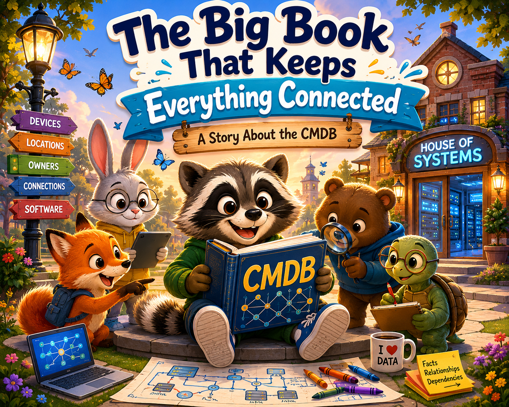
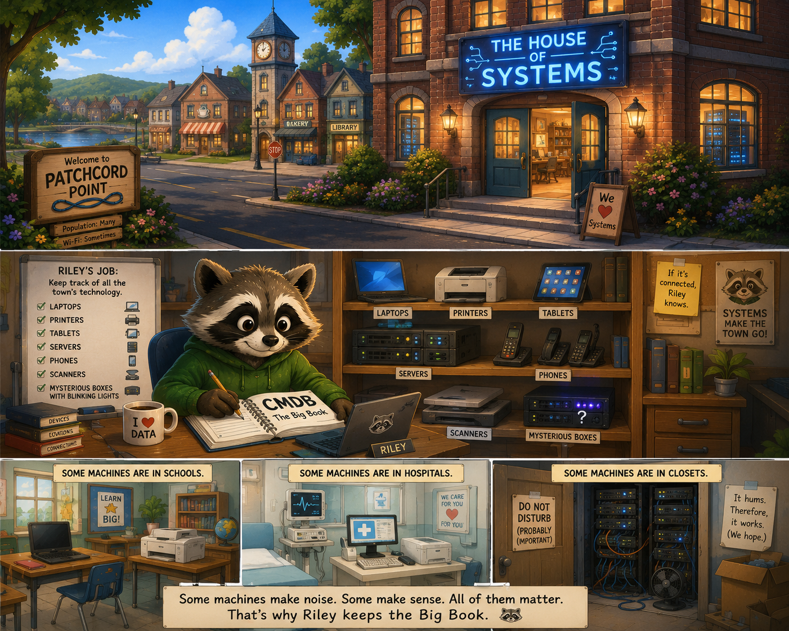
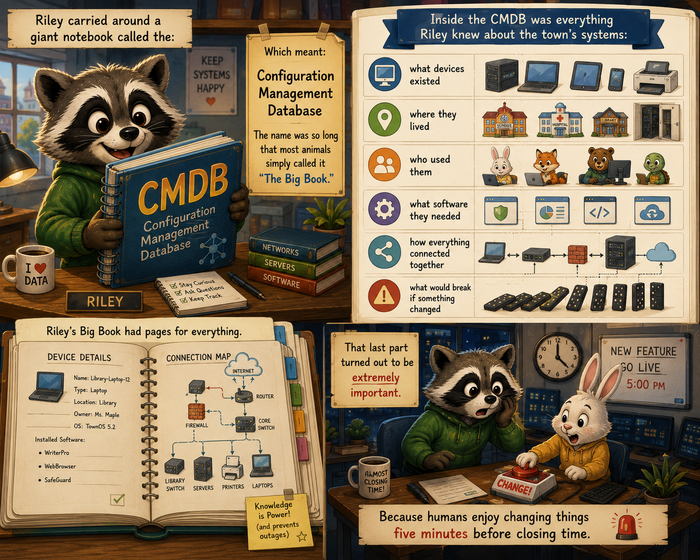
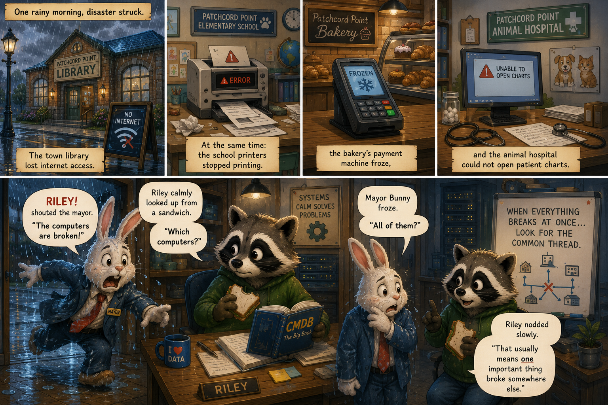
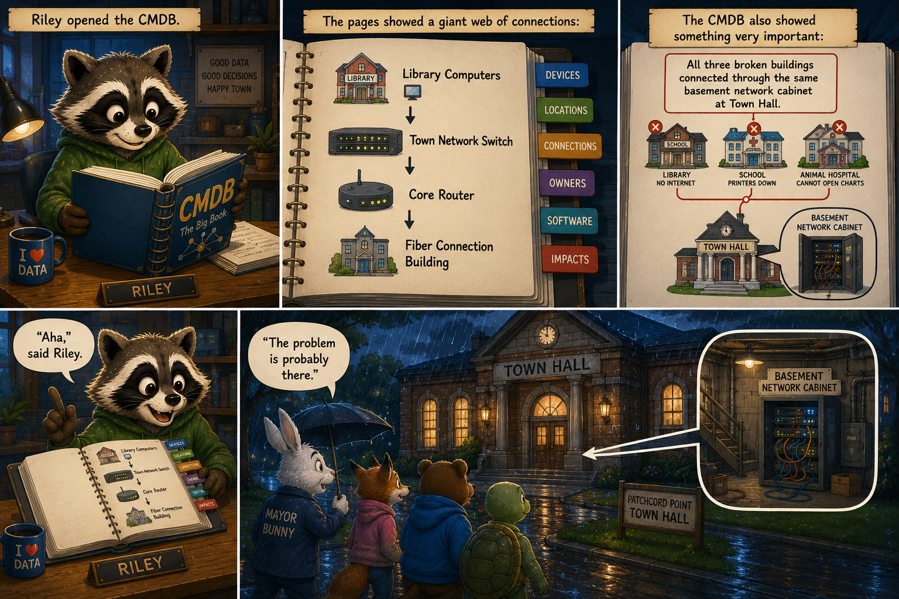
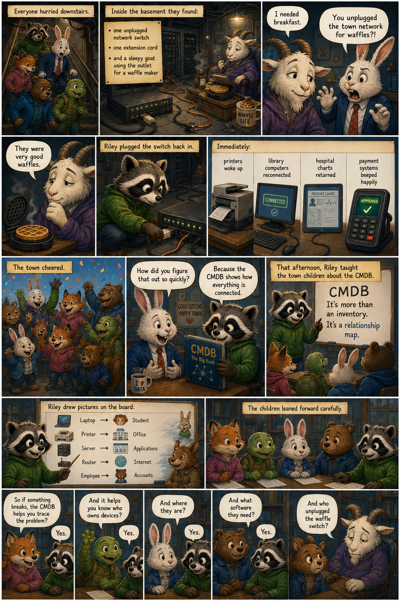

# The House of Systems

In the middle of a busy little town called Patchcord Point stood a tall brick building with a glowing blue sign:

The House of Systems

Inside worked a patient raccoon named Riley.

Riley’s job was to keep track of all the town’s technology:

laptops
printers
tablets
servers
phones
scanners
mysterious boxes with blinking lights

Some machines were in schools.

Some were in hospitals.

Some sat in closets humming loudly for reasons nobody fully understood. Humanity has built entire careers around “the server makes a noise now.” Remarkable species. 🖥️

--

Riley carried around a giant notebook called the:

CMDB

Which meant:

Configuration Management Database

The name was so long that most animals simply called it “The Big Book.”

Inside the CMDB was everything Riley knew about the town’s systems:

what devices existed
where they lived
who used them
what software they needed
how everything connected together
what would break if something changed

That last part turned out to be extremely important.

Because humans enjoy changing things five minutes before closing time.

--

One rainy morning, disaster struck.

The town library lost internet access.

At the same time:

the school printers stopped printing
the bakery’s payment machine froze
and the animal hospital could not open patient charts

Mayor Bunny burst into the House of Systems soaking wet.

“RILEY!” shouted the mayor.

“The computers are broken!”

Riley calmly looked up from a sandwich.

“Which computers?”

Mayor Bunny froze.

“All of them?”

Riley nodded slowly.

“That usually means one important thing broke somewhere else.”

--

Riley opened the CMDB.

The pages showed a giant web of connections:

Library Computers
⬇
Town Network Switch
⬇
Core Router
⬇
Fiber Connection Building

The CMDB also showed something very important:

All three broken buildings connected through the same basement network cabinet at Town Hall.

“Aha,” said Riley.

“The problem is probably there.”

--

Everyone hurried downstairs.

Inside the basement they found:

one unplugged network switch
one extension cord
and a sleepy goat using the outlet for a waffle maker

The goat blinked.

“I needed breakfast.”

Mayor Bunny stared in disbelief.

“You unplugged the town network for waffles?!”

The goat looked thoughtful.

“They were very good waffles.”

Honestly, fair. Civilization itself hangs by extension cords and snacks most days. 🧇

Riley plugged the switch back in.

Immediately:

printers woke up
library computers reconnected
hospital charts returned
payment systems beeped happily

The town cheered.

Mayor Bunny smiled.

“How did you figure that out so quickly?”

Riley held up the CMDB.

“Because the CMDB shows how everything is connected.”

That afternoon, Riley taught the town children about the CMDB.

“It’s more than an inventory,” Riley explained.

“It’s a relationship map.”

Riley drew pictures on the board:

Laptop → Student
Printer → Office
Server → Applications
Router → Internet
Employee → Accounts

The children leaned forward carefully.

One little fox asked:

“So if something breaks, the CMDB helps you trace the problem?”

“Yes.”

A young turtle raised a hand.

“And it helps you know who owns devices?”

“Yes.”

“And where they are?”

“Yes.”

“And what software they need?”

“Yes.”

“And who unplugged the waffle switch?”

The goat quietly slid lower into their chair.

--

From then on, the town of Patchcord Point ran much more smoothly.

When devices disappeared, the CMDB helped find them.

When systems failed, the CMDB showed dependencies.

When new employees arrived, the CMDB helped prepare accounts and equipment.

And best of all:

when someone asked,
“Does anybody know how this works?”

Riley could answer:

“Yes. It’s documented.”

The children gasped.

Because everyone knew properly documented systems were ancient magic. 📖